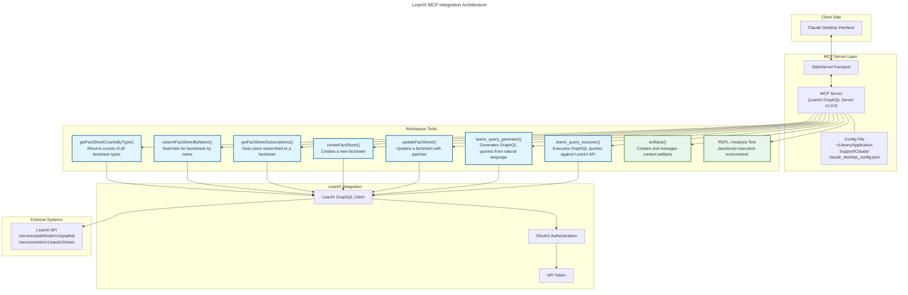

# LeanIX MCP Integration

A Model Context Protocol (MCP) server that connects LeanIX to AI assistants. It exposes LeanIX's GraphQL API as MCP tools that AI assistants can use.

## Table of Contents
- [Core Functionality](#core-functionality)
- [Prerequisites](#prerequisites)
- [Getting Started](#getting-started)
- [Architecture](#architecture)
- [Features](#features)
  - [AI-Powered Query Generation](#ai-powered-query-generation)
  - [Direct LeanIX Operations](#direct-leanix-operations)
  - [Web Research Integration](#web-research-integration)
- [Configuration](#configuration)
- [Development](#development)
  - [Project Structure](#project-structure)
  - [Common Pitfalls](#common-pitfalls)
  - [Debugging Tips](#debugging-tips)
- [Testing](#testing)
- [Resources](#resources)
- [License](#license)

## Core Functionality

This integration provides seven MCP tools for LeanIX operations:

1. **Fact Sheet Overview**: Get counts and statistics of fact sheets in your workspace
2. **Search**: Find fact sheets by their names
3. **Subscription Management**: View who is subscribed to specific fact sheets
4. **Create Fact Sheets**: Add new fact sheets to your workspace
5. **Update Fact Sheets**: Modify existing fact sheet information
6. **AI Query Generation**: Generate GraphQL queries from natural language questions
7. **Query Execution**: Execute dynamically generated GraphQL queries

## Prerequisites

- Node.js (v14 or higher)
- A LeanIX workspace and API token
- Basic understanding of GraphQL and MCP
- Claude Desktop with MCP support

## Getting Started

1. Clone this repository
2. Install dependencies:
   ```bash
   npm install
   ```
3. Create a `.env` file in the root directory with your LeanIX credentials:
   ```
   LEANIX_SUBDOMAIN=your-workspace-subdomain
   LEANIX_TOKEN=your-api-token
   ```
4. Start the server:
   ```bash
   node server.js
   ```

## Architecture

The system architecture is visualized in the following diagram:



The architecture consists of several key components:

1. **Client Side**
   - Claude Desktop Interface: The main user interface for interacting with the system

2. **MCP Server Layer**
   - MCP Server: Handles the LeanIX GraphQL operations (v1.0.0)
   - StdioServerTransport: Manages communication between Claude and the server
   - Config File: Stores server configuration and credentials

3. **Workspace Tools**
   - LeanIX Tools (Blue):
     - getFactSheetCountsByType: Returns counts of all factsheet types
     - searchFactSheetByName: Searches for factsheets by name
     - getFactSheetSubscriptions: Gets users subscribed to a factsheet
     - createFactSheet: Creates a new factsheet
     - updateFactSheet: Updates a factsheet with patches
     - leanix_query_generator: Generates GraphQL queries from natural language
     - leanix_query_executor: Executes GraphQL queries against LeanIX API
   - Utility Tools (Green):
     - artifacts: Creates and manages content artifacts
     - REPL: JavaScript execution environment for analysis

4. **LeanIX Integration**
   - LeanIX GraphQL Client: Handles API communication
   - OAuth2 Authentication: Manages authentication flow
   - API Token: Secures API access

5. **External Systems**
   - LeanIX API: External endpoints for GraphQL and authentication

## Features

### AI-Powered Query Generation

The integration supports natural language query generation using Claude's AI capabilities:

1. Ask questions in plain English about your LeanIX data
2. Claude automatically generates the appropriate GraphQL query
3. Executes the query and presents results in natural language

Example:
```
You: "What applications do we have in production?"

Claude will:
1. Analyze your question
2. Generate a GraphQL query
3. Execute the query
4. Present results in a clear format
```

### Direct LeanIX Operations

- Fact sheet management (create, update, search)
- Subscription tracking
- Workspace statistics
- GraphQL query execution

### Web Research Integration

- Access to LeanIX documentation
- Enterprise architecture best practices
- Supplementary research capabilities

## Configuration

### Claude Desktop Setup

1. Locate your config file:
   - Mac: `~/Library/Application Support/Claude/claude_desktop_config.json`
   - Windows: `%APPDATA%\Claude\claude_desktop_config.json`

2. Add the server configuration:
   ```json
   {
       "mcpServers": {
         "myserver": {
           "command": "node",
           "args": [
             "/path/to/your/lean/server.js"
           ]
         },
         "webresearch": {
           "command": "npx",
           "args": ["-y", "@mzxrai/mcp-webresearch@latest"]
         }
       }
   }
   ```

This configuration enables:
1. **LeanIX Integration**: Replace `/path/to/your/lean/server.js` with the absolute path to your server.js file
2. **Web Research**: Provides supplementary research capabilities for LeanIX-related queries

The integration supports:
- Direct LeanIX data operations through the primary server
- Web research for supplementary LeanIX documentation and enterprise architecture best practices
- Combined operations leveraging both capabilities

## Development

### Project Structure

```
├── server.js            # Main MCP server setup
├── leanix-client.js     # LeanIX API client
├── api                  # API definitions
├── mutation            # GraphQL mutations
├── datamodel           # Data models
├── .env                # Environment config
└── src/
    ├── config/
    │   └── config.js         # Environment setup
    ├── graphql/
    │   └── queries/         # GraphQL queries
    │       ├── factSheetQueries.js
    │       └── workspaceQueries.js
    ├── tools/
    │   └── workspaceTools.js # MCP tools
    ├── types/
    │   └── schemas.js       # Zod schemas
    └── utils/
        └── responseHandler.js # Response formatting
```

### Common Pitfalls

1. **GraphQL Schema Mismatch**: Always check the current LeanIX API schema in their documentation or GraphiQL interface. The schema may change over time.

2. **Response Formatting**: All MCP tool responses must follow this format:
   ```javascript
   {
     content: [{
       type: "text",
       text: "your response here"
     }]
   }
   ```

3. **Error Handling**: Always wrap your tool implementations with `withErrorHandling` to ensure proper error responses.

4. **Environment Variables**: Make sure to properly load and validate environment variables before making any API calls.

### Debugging Tips

1. Enable debug logging in your configuration file to verify environment variables are loaded correctly.
2. Use the LeanIX GraphiQL interface to test your queries before implementing them in your tools.
3. Check the server console for detailed error messages when tools fail.
4. When using AI query generation:
   - Be specific in your questions
   - Include relevant filters or conditions in your natural language query
   - Review the generated GraphQL query if results are unexpected

## Testing

1. Start the server:
   ```bash
   node server.js
   ```

2. The server will connect to your LeanIX workspace and make the tools available through MCP.

3. You can test your tools through Claude Desktop:
   - Try simple queries like "Show me all applications"
   - Ask complex questions like "Which applications are used by our finance department?"
   - Get relationship information like "What IT components are connected to Application X?"

## Resources

- [LeanIX API Documentation](https://docs-eam.leanix.net/reference/graphql-api)
- [GraphQL Documentation](https://graphql.org/learn/)
- [Model Context Protocol Documentation](https://modelcontextprotocol.github.io/)

## License

MIT 